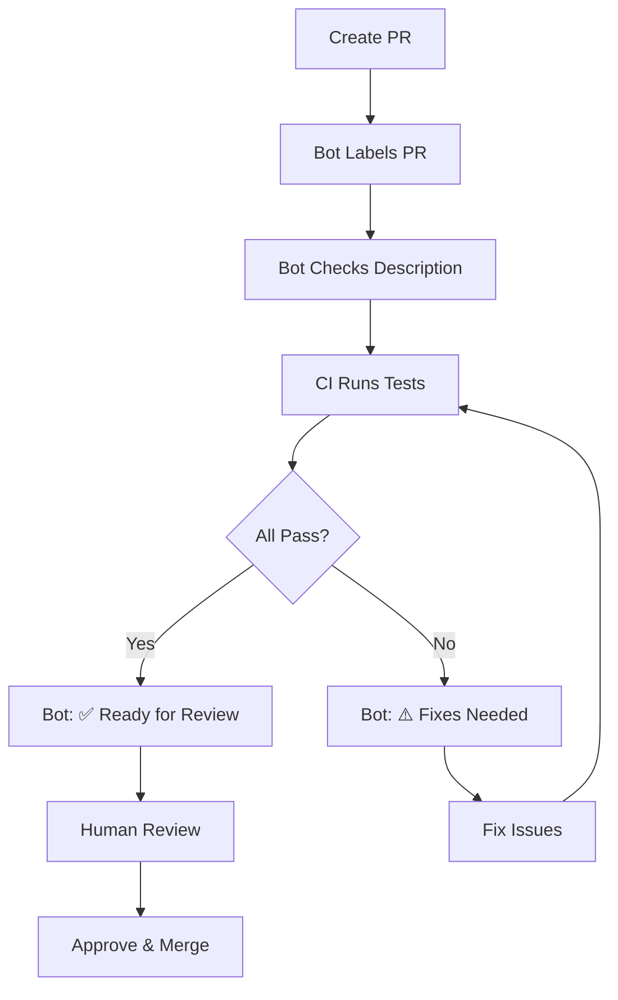

# PR Automation & Bot Features

This document describes the automated PR review and management features in this repository.

## 🤖 PR Review Bot

Our automated PR Review Bot provides intelligent code review and management features to streamline the development process.

### Features

#### 1. **Automatic Labeling**
PRs are automatically labeled based on:
- **Component**: `frontend`, `backend`, `database`, `audio`, `game-logic`, `security`, `ci/cd`
- **Type**: `documentation`, `tests`
- **Size**: `size/xs`, `size/small`, `size/medium`, `size/large`, `size/xl`

Labels are applied automatically when a PR is opened or updated.

#### 2. **Code Quality Checks**
The bot automatically scans for common issues:

**🚨 Issues (Must Fix)**
- `.env` files committed (security risk)
- `package.json` changed without `package-lock.json`
- Missing required updates

**⚠️ Warnings**
- TypeScript changes without tests
- Large files (> 500 lines)
- Missing documentation updates

**💡 Suggestions**
- Refactoring opportunities
- Best practice recommendations
- Performance improvements

#### 3. **PR Description Quality Check**
When you open a PR, the bot checks for:
- Descriptive title (min 10 characters)
- Adequate description (min 50 characters)
- Template sections (Description, Changes, Testing)
- Linked issues (Closes #123, Fixes #456)

If your PR description needs improvement, the bot will comment with specific suggestions.

#### 4. **Test Results Summary**
After CI runs complete, the bot posts a summary comment:
```
## 🤖 PR Check Results

- **Client Tests**: ✅ Passed
- **Server Tests**: ✅ Passed

### ✅ All Checks Passed!
Your PR is ready for review. Great work! 🎉
```

#### 5. **PR Commands**
You can interact with the bot using comments:

| Command | Description |
|---------|-------------|
| `/help` | Show available commands |
| `/review` | Request review from maintainers |
| `/rerun-checks` | Information about re-running checks |

**Example:**
```
/review
```
The bot will add a `review-needed` label and notify maintainers.

## 🏷️ Label System

### Automatic Labels

Labels are automatically applied based on file changes:

**Component Labels**
- `frontend` - Changes in `client/`
- `backend` - Changes in `server/`
- `database` - Changes in `db/`
- `audio` - Changes in DAW/audio components
- `game-logic` - Changes in gacha components
- `security` - Changes in auth/session code
- `ci/cd` - Changes in `.github/workflows/`

**Size Labels**
- `size/xs` - < 10 lines changed
- `size/small` - 10-100 lines
- `size/medium` - 100-300 lines
- `size/large` - 300-500 lines
- `size/xl` - > 500 lines

### Manual Labels

Some labels should be applied manually:

**Priority**
- `priority/critical` - Hotfixes, security issues
- `priority/high` - Important features
- `priority/medium` - Normal priority
- `priority/low` - Nice to have

**Status**
- `review-needed` - Waiting for review
- `changes-requested` - Reviewer requested changes
- `approved` - Ready to merge
- `blocked` - Waiting on dependencies
- `wip` - Still working on it

**Special**
- `good first issue` - Great for new contributors
- `help wanted` - Need community help
- `breaking-change` - API breaking changes

## 📋 PR Workflows

### Opening a PR

1. **Create PR** from your feature branch
2. **Bot auto-labels** based on changed files
3. **Bot checks** PR description quality
4. **CI runs** tests and checks
5. **Bot posts** results summary

### During Review

1. **Reviewers** leave comments
2. You **make changes** and push
3. **CI re-runs** automatically
4. **Bot updates** results comment
5. Use `/review` to **request re-review**

### Before Merging

Ensure:
- ✅ All CI checks pass
- ✅ Code review approved
- ✅ No merge conflicts
- ✅ Branch is up to date
- ✅ PR description is complete

## 🔍 CI/CD Checks

### Main CI Pipeline
Runs on every push and PR:
- ESLint and Prettier checks
- TypeScript type checking
- Unit and integration tests
- Build verification
- Security audit (npm audit)
- Code coverage reporting

### PR-Specific Checks
- Changed file detection
- Targeted test execution
- Dependency review
- License compliance
- CodeQL security scanning (weekly)

### Quality Gates
All checks must pass before merging:
- Linting: 0 warnings
- Type checking: 0 errors
- Tests: All passing
- Coverage: 60% minimum
- Security: No high/critical vulnerabilities

## 🛠️ Customization

### Adding Custom Checks

Edit `.github/workflows/pr-review-bot.yml` to add custom checks:

```yaml
# Add your check
if (someCondition) {
  issues.push('🚨 **Your issue**: Description');
}
```

### Modifying Labels

Edit `.github/labels.yml` and sync with:
```bash
gh label sync --file .github/labels.yml
```

### Adjusting Bot Behavior

The bot can be configured by modifying:
- `.github/workflows/pr-review-bot.yml` - Main bot logic
- `.github/workflows/pr-checks.yml` - CI results formatting
- `.github/workflows/pr-size-labeler.yml` - Size thresholds

## 📊 Metrics

The bot helps track:
- Average PR size
- Time to first review
- CI success rate
- Common issues found
- Code coverage trends

## 🎓 Best Practices

### Write Good PR Descriptions
```markdown
## Description
Clear explanation of what this PR does

## Changes Made
- Added feature X
- Fixed bug Y
- Refactored component Z

## Testing
- Unit tests added
- Manually tested in browser
- No console errors

## Related Issues
Closes #123
```

### Keep PRs Small
- Aim for < 300 lines changed
- Break large features into multiple PRs
- One feature/fix per PR

### Respond to Bot Feedback
- Address 🚨 issues immediately
- Consider ⚠️ warnings seriously
- Evaluate 💡 suggestions

### Use PR Commands
- `/review` when ready
- Check bot comments for guidance
- Re-run checks if needed

## 🚀 Tips for Contributors

1. **Read bot comments** - They contain helpful guidance
2. **Keep PRs focused** - Easier to review
3. **Write tests** - Bot will check for them
4. **Update docs** - Keep documentation current
5. **Link issues** - Use "Closes #123"
6. **Respond promptly** to review comments

## 📝 Example PR Flow



## 🤝 Getting Help

If the bot behaves unexpectedly:
1. Check workflow logs in Actions tab
2. Comment `/help` for available commands
3. Ask maintainers for assistance
4. Report issues with `ci/cd` label

---

**Powered by GitHub Actions** | [View Workflows](.github/workflows/)
